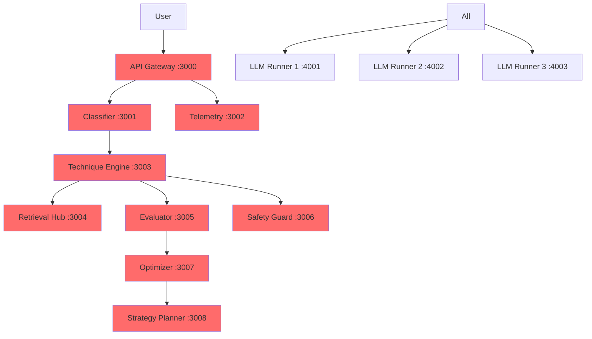
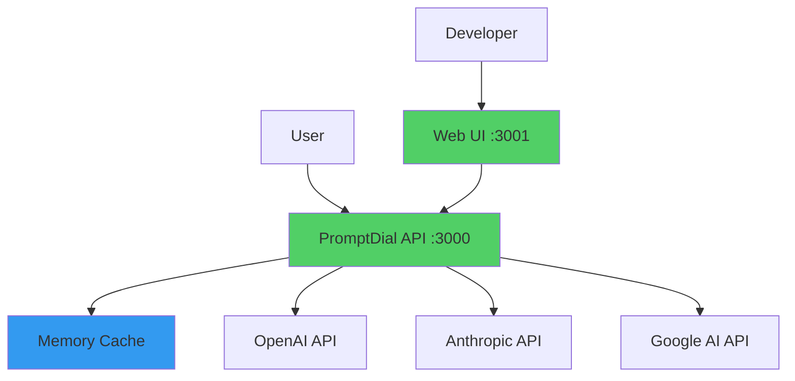

# Architecture Comparison: Complex vs Simple

## Current Architecture (10+ Services) 🚫



### Problems:
- 🔴 10+ services to maintain
- 🔴 10+ network hops per request
- 🔴 Complex deployment (Docker Compose)
- 🔴 Distributed debugging nightmare
- 🔴 Each service adds 5-50ms latency
- 🔴 Any service failure = total failure

## Recommended Architecture (1-2 Services) ✅



### Benefits:
- ✅ 1-2 services total
- ✅ Direct API calls (fast)
- ✅ Single deployment unit
- ✅ Easy debugging
- ✅ 90% less code
- ✅ Can run on $5/month VPS

## Request Flow Comparison

### Current (Complex) - 1200ms+ 
```
1. User → API Gateway (30ms)
2. → Task Classifier (50ms)
3. → Technique Engine (40ms)
4. → Safety Guard (60ms)
5. → LLM Runner (800ms)
6. → Evaluator (80ms)
7. → Optimizer (40ms)
8. → Response formatting (100ms)
Total: 1200ms + network overhead
```

### Recommended (Simple) - 850ms
```
1. User → API (10ms)
2. → Cache check (1ms)
3. → LLM call (800ms)
4. → Response (39ms)
Total: 850ms
```

## Deployment Comparison

### Current
```yaml
# 13 containers, 4GB+ RAM needed
services:
  api-gateway:
    image: promptdial/gateway
    ports: ["3000:3000"]
  classifier:
    image: promptdial/classifier
    ports: ["3001:3001"]
  # ... 10 more services
```

### Recommended
```bash
# 1 process, 256MB RAM
npm start
# or
docker run -p 3000:3000 promptdial
```

## Cost Comparison (Monthly)

### Current Architecture
- AWS ECS/K8s: $200-500/month
- 10+ containers = 10+ compute units
- Load balancer required
- Service mesh overhead
- Monitoring complexity

### Recommended Architecture  
- Railway/Render: $5-20/month
- Single container
- Built-in SSL & monitoring
- Auto-scaling included
- One-click deploy

## The Bottom Line

| Metric | Current | Recommended | Improvement |
|--------|---------|-------------|-------------|
| Services | 10+ | 1-2 | 80-90% reduction |
| Latency | 1200ms+ | 850ms | 30% faster |
| Code Complexity | High | Low | 90% simpler |
| Deployment Time | 30+ min | 2 min | 15x faster |
| Monthly Cost | $200-500 | $5-20 | 95% cheaper |
| Dev Time | Weeks | Days | 5x faster |

## Real World Example

### Netflix Approach ❌
```
User → Edge Service → Account Service → Preference Service → 
Content Service → Recommendation Service → ML Service → 
Response Aggregator → User
```

### Stripe Approach ✅
```
User → API → Response
(with intelligent internal modules)
```

**Be like Stripe, not like Netflix (unless you're Netflix-scale).**